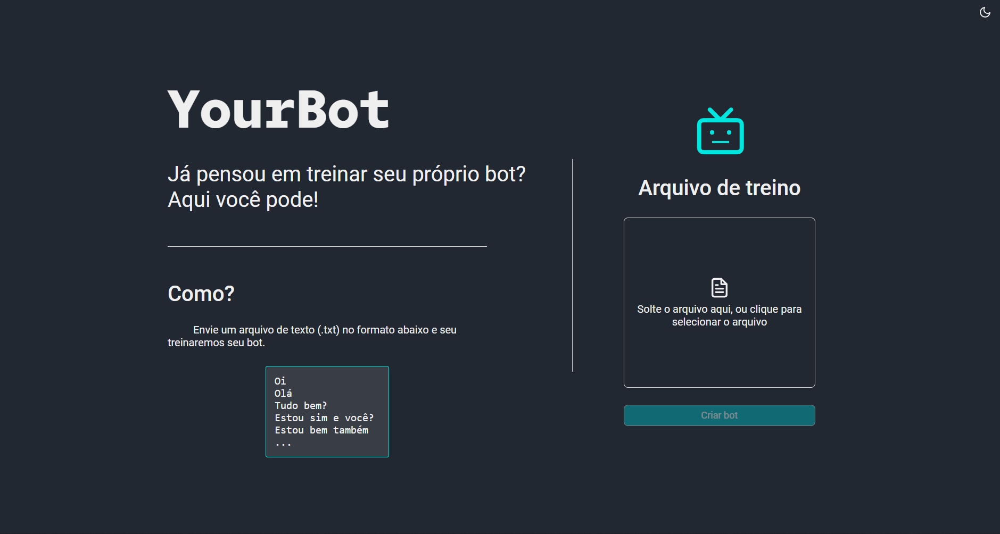
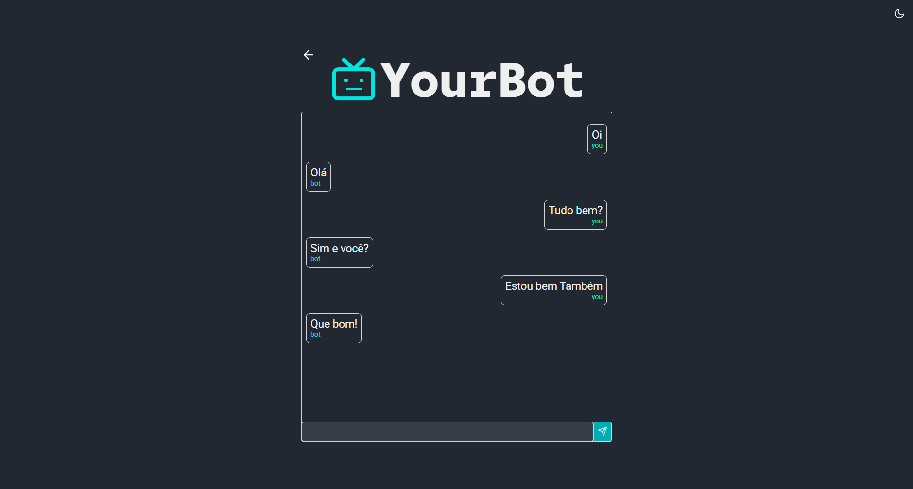

# YourBot

Treine seu chatbot com um arquivo de texto (.txt) e converse com ele.

## Descrição

Na pasta `api` do projeto temos o back-end do projeto feito com python e lib [ChatterBot](https://chatterbot.readthedocs.io/en/stable/) para criação e treinamento do chatbot, sqlite para armazenar os dados e [Flask](https://flask.palletsprojects.com/en/2.0.x/) para consumo da api no front-end.

- Rota **POST**`/train`

  Recebe um arquivo 'file' no formato .txt para treinamento do chatbot.

- Socket event `message`

  Ao receber o evento `message` com a mensagem do usuário o socket emite um evento `message` com a resposta.

Na pasta web temos o front-end do projeto criado com [vite](https://vitejs.dev) utilizando o template react + typescript. Utilizou-se do [axios](https://axios-http.com/docs/intro) para o consumo da API e [socket.io-client](https://socket.io/docs/v4/client-api/) para comunicação através de web sockets.

- Página `Home`

  Introdução ao site e formulário de upload do arquivo de treinamento.

  

- Página `Bot`

  Página utilizad para conversar com o chatbot.

  

## Como executar o projeto

***Esse projeto requer que tenha o Phyton3 e Node lts instalado**

```bash

  # Clone esse projeto em sua máquina
  git clone https://github.com/DanielSLucas/YourChatBot.git

  # Já dentro da pasta do projeto abra a pasta da 'api'
  cd api

  # Instale as dependências do projeto
  pip install -r ./requirements.txt

  # Inicie a API, que vai estar disponível na porta :5000
  python3 app.py

  # Abra uma nova aba no terminal, acesse a pasta do projeto e então abra pasta 'web'
  cd web

  # Instale as dependencias do projeto
  yarn # ou npm i

  # Inicie o projeto que vai estar disponível na porta :3000
  yarn dev # ou npm dev
```
***OBS**:
Pode ser que após a instalação das depencias da API você se depare com o seguinte erro:
```
  ...
    Can't find model 'en'. It looks like you're trying to load a model...
  ...
```
Se isso acontecer faça o seguinte:

1. Instale o modelo de NLU:
  ```bash
    python3 -m spacy download en_core_web_sm
  ```
2. Abra o arquivo `tagging.py` dentro da pasta da lib `Chatterbot`.
  
    *A localização dessa pasta pode variar dependendo se você instalou as dependencias em seu computador ou em um ambiente virtual, mas em geral busque pela pasta da versão do Python que está utilizando e o caminho será mais ou menos esse `Python37\lib\site-packages\chatterbot\tagging.py`

3. Nesse arquivo procure pela linha que contenha `self.nlp = spacy.load(self.language.ISO_639_1.lower())` e substitua ela por:
```py
  if self.language.ISO_639_1.lower() == 'en':
    self.nlp = spacy.load('en_core_web_sm')
  else:
    self.nlp = spacy.load(self.language.ISO_639_1.lower())
```

Com isso seu problema estará resolvido!
